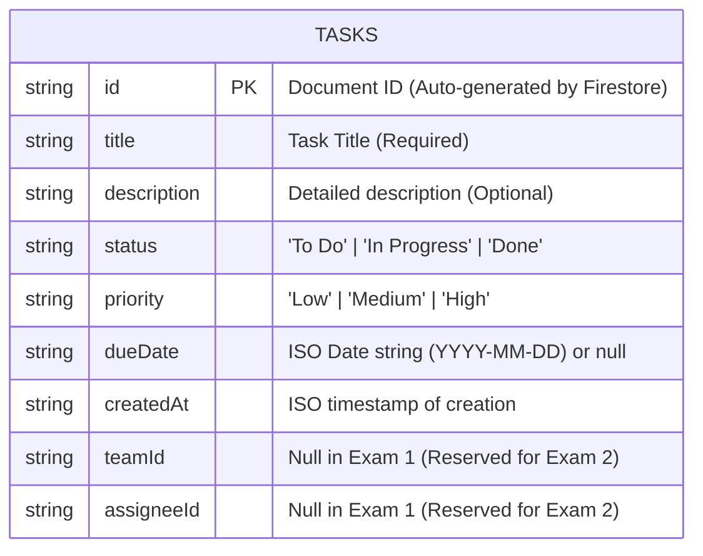

# 📱 Task Management App (React Native & Firebase)

> **Practical Exam 1 – Mobile Application Development**
> A modern, responsive Task Management mobile application built with **React Native (Expo)** and **Firebase Cloud Firestore**.

---

## 🚀 Overview & Features

- **Public Task CRUD**: Create, read, update, and delete tasks in real-time without authentication.
- **Real-Time Data Sync**: Powered by Cloud Firestore `onSnapshot` listener for instant synchronization.
- **Bottom Tab Navigation**: Clean navigation between **Tasks (Home)**, **Teams** (Coming soon), and **Profile** (Coming soon).
- **Client-Side Validation**: Validates required task titles with immediate user feedback.
- **Filter & Search**: Quick filter by status (*All*, *To Do*, *In Progress*, *Done*) with task counts, plus instant text search.
- **Pull-to-Refresh**: Refresh tasks manually on demand.
- **Responsive Layout**: Adapts gracefully across both phone-sized screens and tablet-sized devices.
- **Offline / Preview Fallback**: Seamless fallback to local mock storage if Firebase configuration keys are missing, preventing runtime crashes.

---

## 🗂️ Project Architecture & Folder Structure

```
task-management-app-native/
├── .github/
│   └── workflows/
│       └── ci.yml               # GitHub Actions CI for lint & type checking
├── assets/                      # Application icons & splash assets
├── src/
│   ├── components/              # Reusable UI components
│   │   ├── EmptyState.tsx       # Placeholder when no tasks exist
│   │   ├── Header.tsx           # App header & Firebase connection indicator
│   │   ├── StatusFilter.tsx     # Status filter chips with live counts
│   │   ├── TaskCard.tsx         # Task card item with badges, edit & delete
│   │   └── TaskModal.tsx        # Modal form for creating & editing tasks
│   ├── constants/
│   │   └── theme.ts             # Theme colors, tokens, and options
│   ├── hooks/
│   │   └── useTasks.ts          # Custom hook for task state & operations
│   ├── navigation/
│   │   └── AppNavigator.tsx     # React Navigation Bottom Tabs navigator
│   ├── screens/
│   │   ├── HomeScreen.tsx       # Main task list & CRUD screen
│   │   ├── ProfileScreen.tsx    # User profile placeholder screen (Exam 2)
│   │   └── TeamsScreen.tsx      # Teams collaboration placeholder screen (Exam 2)
│   ├── services/
│   │   ├── firebase.ts          # Firebase SDK initialization & env loader
│   │   └── taskService.ts       # Firestore CRUD logic (onSnapshot, addDoc, updateDoc, deleteDoc)
│   └── types/
│       └── task.ts              # TypeScript models and interfaces
├── .env.example                 # Example environment variables template
├── .gitignore                   # Git ignore file (excludes secrets, build artifacts)
├── .prettierrc                  # Prettier code formatting rules
├── eslint.config.js             # ESLint configuration with Expo & Prettier plugins
├── App.tsx                      # Application root entry
├── app.json                     # Expo configuration
├── package.json                 # Project dependencies & npm scripts
└── tsconfig.json                # TypeScript compiler configuration
```

---

## 📊 Entity Relationship Diagram (ERD) / Data Model

### Firestore Collection: `tasks`



### Document Attributes

| Field Name | Type | Required | Description |
|---|---|---|---|
| `id` | `string` | Yes | Firestore auto-generated document ID |
| `title` | `string` | Yes | Name of the task |
| `description` | `string` | No | Additional notes/details |
| `status` | `string` | Yes | Task state: `'To Do'`, `'In Progress'`, or `'Done'` |
| `priority` | `string` | Yes | Task priority level: `'Low'`, `'Medium'`, or `'High'` |
| `dueDate` | `string \| null` | No | Target completion date (e.g., `2026-10-15`) |
| `createdAt` | `string` | Yes | Creation ISO timestamp |
| `teamId` | `string \| null` | No | Team identifier (reserved for Practical Exam 2) |
| `assigneeId` | `string \| null` | No | Assignee identifier (reserved for Practical Exam 2) |

---

## ⚙️ External Systems Setup Guide (Firebase Firestore)

Follow these steps to connect your own Firebase project:

### 1. Create a Firebase Project
1. Navigate to the [Firebase Console](https://console.firebase.google.com/).
2. Click **Add project**, enter a name (e.g. `task-manager-app`), and click **Continue**.
3. (Optional) Disable or enable Google Analytics, then click **Create project**.

### 2. Enable Cloud Firestore
1. In the left navigation menu, go to **Build** > **Firestore Database**.
2. Click **Create database**.
3. Choose a location nearest to you (e.g. `asia-southeast1` or `us-central1`).
4. Select **Start in test mode** (allows public read/write access for this exam without authentication):
   ```javascript
   rules_version = '2';
   service cloud.firestore {
     match /databases/{database}/documents {
       match /{document=**} {
         allow read, write: if true;
       }
     }
   }
   ```
5. Click **Enable**.

### 3. Register a Web App & Retrieve Configuration
1. In Project Overview, click the **Web icon (`</>`)** to add an app.
2. Enter an app nickname (e.g., `task-manager-mobile`) and click **Register app**.
3. Copy the `firebaseConfig` keys from the SDK snippet.

### 4. Configure Local Environment Variables
Create a `.env` file in the project root based on `.env.example`:

```bash
cp .env.example .env
```

Fill in the keys with your Firebase project credentials:

```env
EXPO_PUBLIC_FIREBASE_API_KEY=AIzaSy...
EXPO_PUBLIC_FIREBASE_AUTH_DOMAIN=your-app.firebaseapp.com
EXPO_PUBLIC_FIREBASE_PROJECT_ID=your-app
EXPO_PUBLIC_FIREBASE_STORAGE_BUCKET=your-app.appspot.com
EXPO_PUBLIC_FIREBASE_MESSAGING_SENDER_ID=1234567890
EXPO_PUBLIC_FIREBASE_APP_ID=1:1234567890:web:abcdef123456
EXPO_PUBLIC_FIREBASE_MEASUREMENT_ID=G-XXXXXXXXXX
```

> **Note**: `.env` is already configured in `.gitignore` to prevent leaking keys into version control.

### 5. Add Sample Data (Optional)
In the Firebase Console under **Firestore Database** > **Data**:
1. Click **Start collection**, name it `tasks`.
2. Add a document with auto ID and fields:
   - `title` (string): `Setup Firebase connection`
   - `description` (string): `Connected Firestore to Expo React Native`
   - `status` (string): `In Progress`
   - `priority` (string): `High`
   - `dueDate` (string): `2026-10-20`
   - `createdAt` (string): `2026-10-06T12:00:00.000Z`
   - `teamId` (null)
   - `assigneeId` (null)

---

## 🛠️ Development & Available Scripts

In the project root:

```bash
# Start Expo development server
npm start

# Run on Android emulator / device
npm run android

# Run on iOS simulator / device
npm run ios

# Run in Web browser
npm run web

# Check TypeScript types
npm run typecheck

# Run ESLint validation
npm run lint

# Format code with Prettier
npm run format
```
